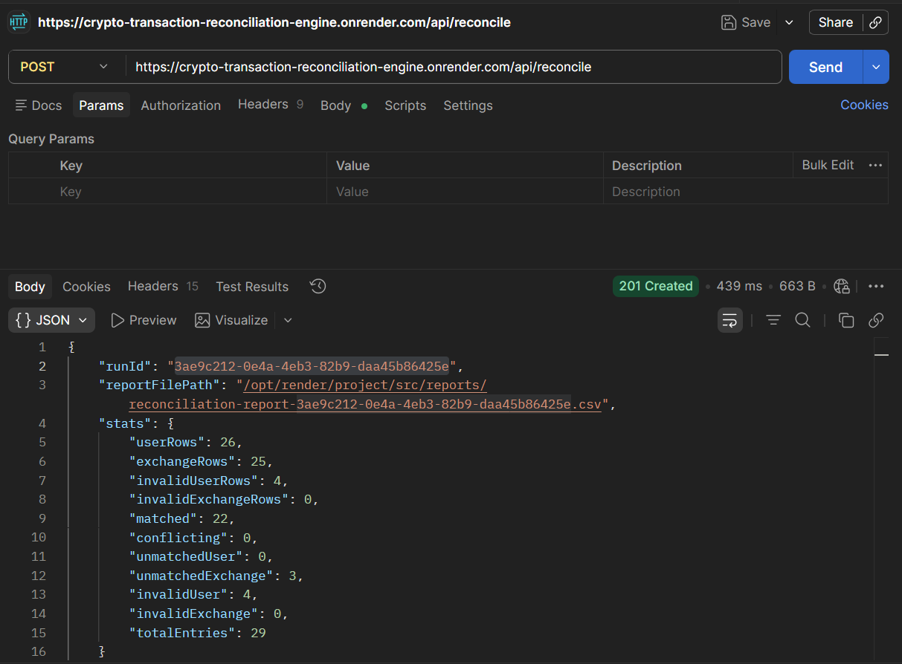
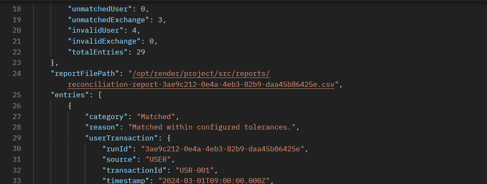
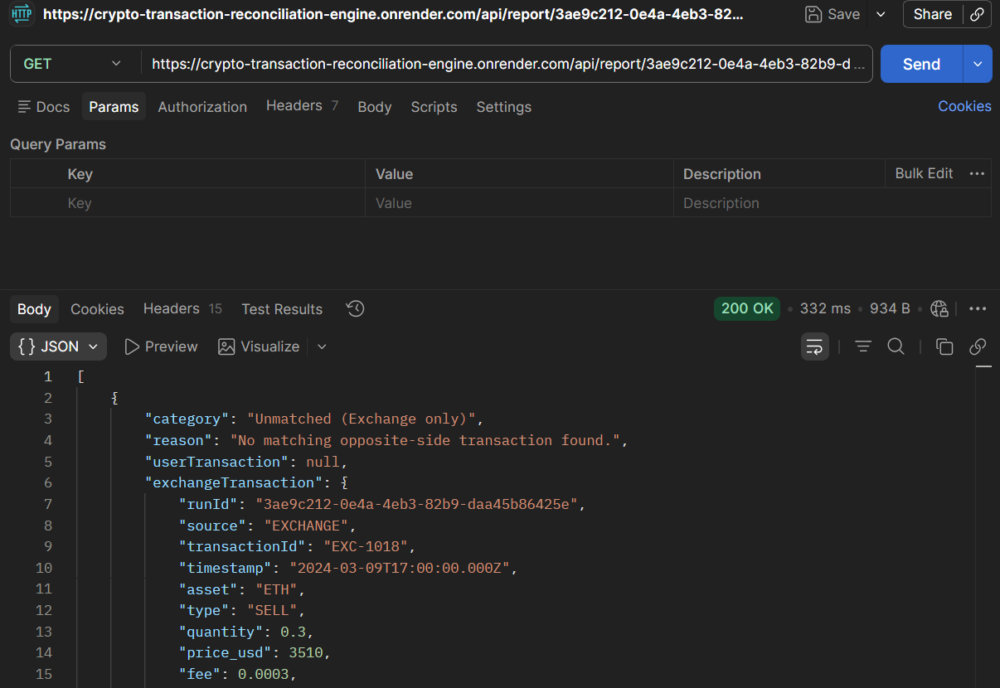
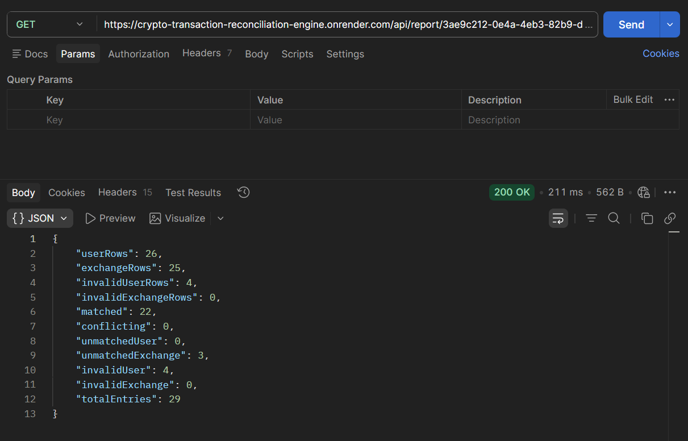

# Crypto Reconciliation Engine

A Node.js + MongoDB backend system for reconciling crypto transaction datasets from user and exchange sources.

## Features

- CSV ingestion and validation
- Asset and transaction type normalization
- Configurable fuzzy matching engine
- Reconciliation report generation
- MongoDB persistence
- REST API support

## Tech Stack

- Node.js
- Express.js
- MongoDB
- Mongoose
- Multer
- CSV Parser

This project is a Node.js reconciliation engine for comparing two CSV transaction datasets:

- `uploads/user_transactions.csv`
- `uploads/exchange_transactions.csv`

It validates each row, normalizes asset symbols and transaction types, matches user transactions against exchange transactions, classifies results as `Matched`, `Conflicting`, or `Unmatched`, writes a CSV report, and stores the reconciliation data in MongoDB.


---

## Setup

### Prerequisites

- Node.js 18+ (or a compatible modern Node version)
- MongoDB database (Atlas or local)
- `npm`

### Install dependencies

```bash
npm install
```

### Environment configuration

Create a `.env` file in the project root with at least:

```env
MONGO_URI=<your-mongodb-connection-string>
PORT=5000
TIMESTAMP_TOLERANCE_SECONDS=300
QUANTITY_TOLERANCE_PCT=0.01
REPORTS_DIR=reports
USER_CSV_DEFAULT=uploads/user_transactions.csv
EXCHANGE_CSV_DEFAULT=uploads/exchange_transactions.csv
```

### Run the application

```bash
npm start
```

For development with automatic reload:

```bash
npm run dev
```

---

## Project structure

```text
src/
├── config/
├── controllers/
├── models/
├── routes/
├── services/
├── utils/
├── app.js
└── server.js
```

- `src/server.js` - entry point; connects to MongoDB and starts the Express server
- `src/app.js` - Express app setup, CORS, JSON parsing, routes
- `src/config/index.js` - loads environment variables and default values
- `src/routes/reconciliationRoutes.js` - API route definitions
- `src/controllers/reconciliationController.js` - main reconciliation orchestration
- `src/services/csvIngestionService.js` - CSV ingestion, validation, normalization, MongoDB insert
- `src/services/reconciliationService.js` - matching logic, classification, CSV report generation
- `src/models/Transaction.js` - MongoDB schema for raw transaction rows
- `src/models/ReconciliationRun.js` - MongoDB schema for reconciliation run history and results
- `src/utils/typeMapper.js` - normalizes transaction types
- `src/utils/assetMapper.js` - normalizes asset aliases
- `uploads/` - default CSV source files
- `reports/` - generated reconciliation reports

---

## How it works

1. The server starts and connects to MongoDB.
2. A reconciliation request is sent to `POST /api/reconcile`.
3. The controller reads the CSV files, either from default paths or from request-provided paths.
4. Each row is validated and normalized:
   - `timestamp` is parsed into a JavaScript `Date`
   - `asset` values are normalized to canonical symbols like `BTC`, `ETH`, `USDT`, `SOL`, `MATIC`, `LINK`
   - transaction `type` values are normalized, with `TRANSFER_IN` and `TRANSFER_OUT` treated as `TRANSFER`
5. Valid rows are matched across sides using a two-tier approach:
   - **First priority**: if transaction IDs match exactly, that is the match
   - **Second priority**: fuzzy match by asset, type, timestamp, and quantity
6. Each match is classified as:
   - `Matched`
   - `Conflicting`
   - `Unmatched (User only)`
   - `Unmatched (Exchange only)`
   - `Invalid (User only)`
   - `Invalid (Exchange only)`
7. A CSV report is generated in `reports/`.
8. A `ReconciliationRun` record is saved in MongoDB with stats, config, and entries for later retrieval.

---

## API

### POST `/api/reconcile`

Triggers a reconciliation run.

This endpoint supports uploading CSV files using `multipart/form-data`.

Accepted form fields:

- `user` - user transactions CSV file upload
- `exchange` - exchange transactions CSV file upload
- `config` (optional) - JSON string or object with:
  - `timestampToleranceSeconds`
  - `quantityTolerancePct`

Fallback options:

- `userFilePath` (optional) - path to user CSV if files are not uploaded
- `exchangeFilePath` (optional) - path to exchange CSV if files are not uploaded

Example multipart form data usage:

- `user`: upload file value for `uploads/user_transactions.csv`
- `exchange`: upload file value for `uploads/exchange_transactions.csv`
- `config`: `{ "timestampToleranceSeconds": 300, "quantityTolerancePct": 0.01 }`

Example JSON request body (fallback only):

```json
{
  "userFilePath": "uploads/user_transactions.csv",
  "exchangeFilePath": "uploads/exchange_transactions.csv",
  "config": {
    "timestampToleranceSeconds": 300,
    "quantityTolerancePct": 0.01
  }
}
```

Response:

- `runId`
- `reportFilePath`
- `stats`

### Example Response

```json
{
  "runId": "665f7c91e6a8c1",
  "reportFilePath": "reports/reconciliation-report.csv",
  "stats": {
    "matched": 120,
    "conflicting": 5,
    "unmatchedUser": 7,
    "unmatchedExchange": 3
  }
}

## API Endpoints

| Method | Endpoint | Description |
|---|---|---|
| POST | `/api/reconcile` | Trigger reconciliation run |
| GET | `/api/report/:runId` | Fetch full reconciliation report |
| GET | `/api/report/:runId/summary` | Fetch reconciliation summary |
| GET | `/api/report/:runId/unmatched` | Fetch unmatched entries only |

---

## Configuration

The reconciliation tolerances are configurable without code changes via:

- `.env` environment variables
- runtime request body overrides on `/api/reconcile`

Supported values:

- `TIMESTAMP_TOLERANCE_SECONDS` - default `300`
- `QUANTITY_TOLERANCE_PCT` - default `0.01`

Example `.env` override:

```env
TIMESTAMP_TOLERANCE_SECONDS=600
QUANTITY_TOLERANCE_PCT=0.05
```

Example request override:

```json
{
  "config": {
    "timestampToleranceSeconds": 600,
    "quantityTolerancePct": 0.05
  }
}
```

---

## Key implementation decisions

### 1. Validation behavior

- All CSV rows are ingested and stored in MongoDB, even invalid ones.
- Invalid rows are marked with `isValid: false` and a `validationErrors` list.
- Invalid user rows are categorized as `Invalid (User only)`.
- Invalid exchange rows are categorized as `Invalid (Exchange only)`.

### 2. Transaction ID priority matching

- When matching user and exchange transactions, the engine prioritizes **exact transaction ID matches**.
- If both sides have a transaction ID and they match exactly, that match is used immediately.
- If no ID match exists, the engine falls back to **fuzzy matching** using asset, type, timestamp, and quantity.
- This two-tier approach ensures high-confidence matches are found first while maintaining flexibility for proximity-based reconciliation.

### 3. Normalization assumptions

- Asset aliases are normalized to canonical symbols.
- `TRANSFER_IN` and `TRANSFER_OUT` are treated as `TRANSFER` so transfer flows can reconcile.
- Type and asset comparisons are case-insensitive.

### 4. Tolerance interpretation

- `TIMESTAMP_TOLERANCE_SECONDS` is interpreted as seconds.
- `QUANTITY_TOLERANCE_PCT` is interpreted as a percentage value.
  - For example, `0.01` means `0.01%`, not `1%`.
- Quantity difference is computed relative to the larger absolute quantity value.

### 5. Conflict classification

- If both timestamp and quantity are within tolerance → `Matched`
- If one side is within tolerance but the other is not → `Conflicting`
- If both values are outside tolerance but still reasonably close (2x timestamp or 5x quantity tolerance) → `Conflicting`
- If there is no reasonable match → `Unmatched`

### 6. Report design

- The generated CSV includes both the user and exchange rows on the same line, plus the diff values and reason text.
- This makes it easy to review which side caused the mismatch.

### 7. Data persistence

- `Transaction` documents store each ingested row for audit and debugging.
- `ReconciliationRun` documents store each run's configuration, statistics, report path, and entry-level reconciliation results.

---

## Notes

- The default CSV paths are `uploads/user_transactions.csv` and `uploads/exchange_transactions.csv`.
- The report files are saved into `reports/`.
- If you want a different file path or a different tolerance, pass it in the `/api/reconcile` request body.

---

## How to explain it to someone else

This app is essentially a transaction comparison engine that:

1. reads two CSVs,
2. sanitizes and validates them,
3. matches them by asset and type,
4. checks whether the matched values are within tolerated time and quantity differences,
5. labels each result as matched/conflicting/unmatched,
6. saves the findings in MongoDB,
7. writes a friendly reconciliation CSV report.

That is the complete workflow from input to output.


## Future Improvements

- Add pagination for large reports
- Add unit and integration tests
- Add background job processing for large CSV files
- Add frontend dashboard for reconciliation visualization
- Add Docker support


## Reconciliation Workflow

```text
CSV Upload
   ↓
Validation & Normalization
   ↓
MongoDB Storage
   ↓
Transaction Matching
   ↓
Conflict Detection
   ↓
CSV Report Generation
   ↓
REST API Response
```


## API Testing Results

### POST API

<br><br>

<br><br>

### GET API

<br><br>

<br><br>

<br><br>
